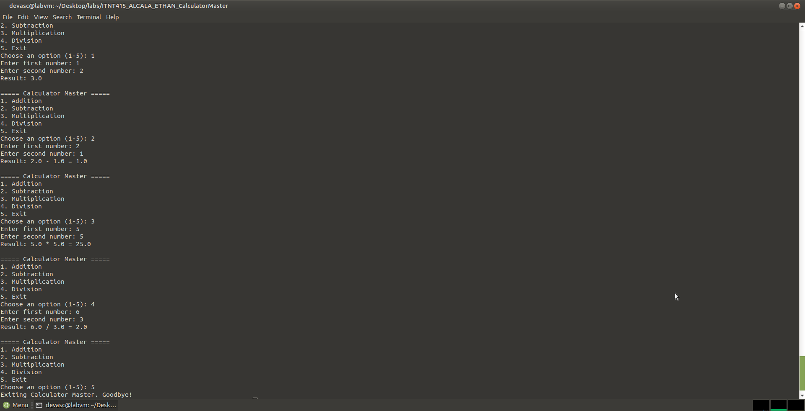

# Calculator Master

## Student Name
Ethan B. Alcala

## Course and Section
ITNT415 - BIT41

## Project Description
A menu-driven Python calculator built using Git and GitHub branching.
Each arithmetic operation (addition, subtraction, multiplication,
division) was developed on its own feature branch, committed at
least twice, and merged into main through an approved Pull Request.
The final program wraps all four operations in a continuous loop
with a dedicated exit option.

## Branch Structure
- `main` - integrated final calculator
- `addition_ALCALA` - addition feature
- `subtraction_ALCALA` - subtraction feature
- `multiplication_ALCALA` - multiplication feature
- `division_ALCALA` - division feature

## Program Features
- Menu-driven interface with continuous execution until Exit
- Input validation for non-numeric entries
- Dedicated function for each arithmetic operation
- Zero-multiplication note
- Division-by-zero handling with a clean error message
- Rounded division output

## Sample Execution Screenshot

